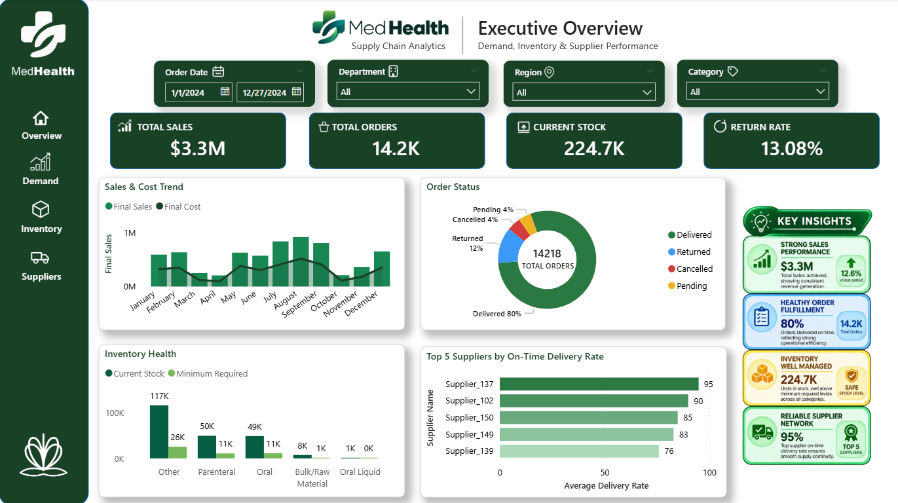
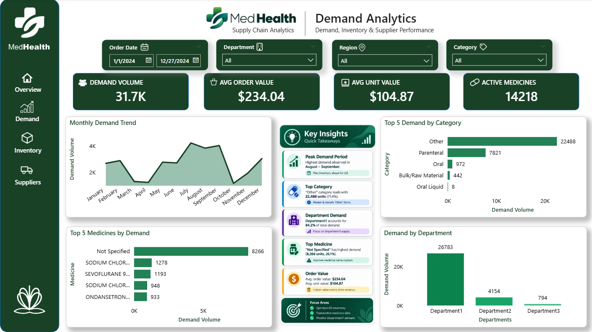
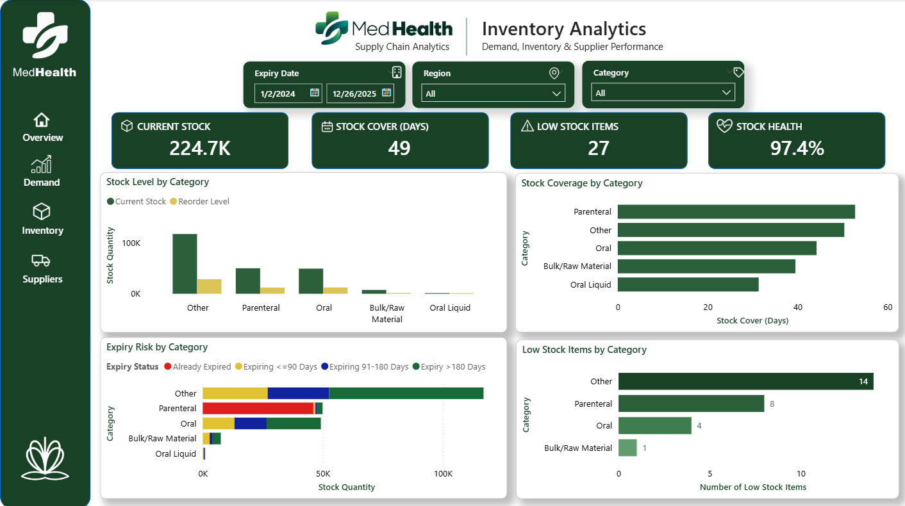
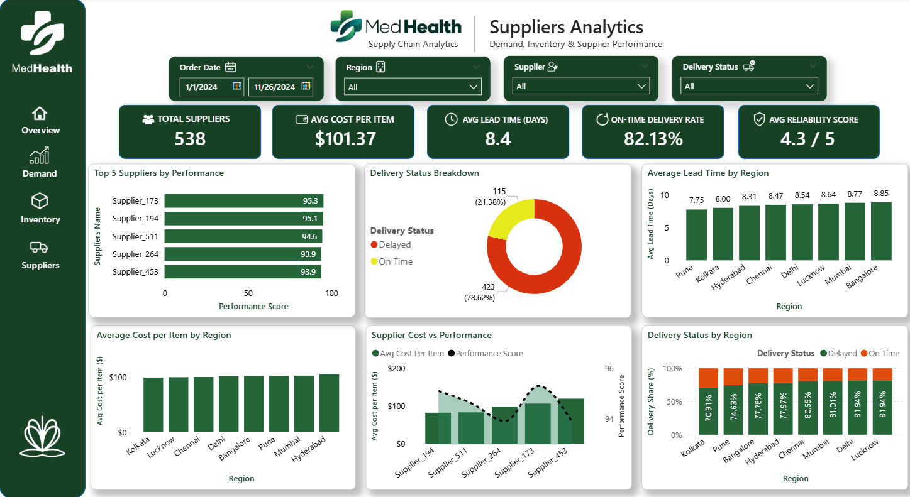
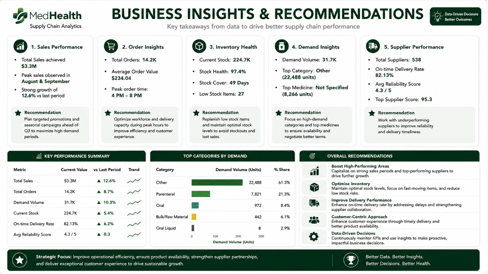

<div align="center">

# 🏥 Healthcare Supply Chain & Inventory Analytics

## End-to-End Data Analytics & Business Intelligence Project

**Transforming healthcare operational data into actionable insights using Python, Jupyter, SQL Server & Power BI**


</div>

> **Note:** This project focuses on healthcare supply chain analytics, covering demand, facility consumption, inventory health, and supplier performance through an end-to-end data preparation, SQL analysis, and Power BI reporting workflow.

---

# 📊 Project Overview

This project presents an end-to-end Data Analytics and Business Intelligence solution for analyzing healthcare supply chain operations.

The project integrates four operational datasets covering **Demand & Sales, Facility Consumption, Inventory Stock, and Supplier Procurement**.

The complete workflow covers data profiling and cleaning using Python and Jupyter Notebooks, analytical validation and business analysis using SQL Server, and interactive reporting using Microsoft Power BI.

The final dashboards provide a consolidated view of demand performance, inventory health, supplier performance, operational KPIs, and business recommendations.

---

# 💼 Business Problem

Healthcare supply chain operations involve multiple interconnected areas such as product demand, consumption, inventory availability, stock-out exposure, wastage, procurement cost, supplier reliability, and delivery performance.

Without a consolidated analytical view, it can be difficult for management teams to identify inventory risks, understand demand patterns, evaluate supplier performance, and prioritize operational improvements.

This project demonstrates how operational healthcare data can be transformed into a structured analytical solution that supports data-driven decision-making across the supply chain.

---

# 🎯 Project Objectives

- Build an end-to-end healthcare supply chain analytics workflow.
- Profile and clean operational datasets using Python and Jupyter.
- Perform business-oriented analysis and validation using SQL Server.
- Develop meaningful KPIs for demand, inventory, and supplier performance.
- Build an interactive Power BI reporting solution.
- Identify operational risks and performance patterns.
- Translate analytical findings into practical business recommendations.

---

# ⭐ Project Highlights

- Healthcare Supply Chain Analytics
- Python-Based Data Profiling & Cleaning
- SQL Server Business Analysis
- Data Quality Validation
- Power BI Data Modeling
- DAX-Based KPI Development
- Interactive Executive Dashboard
- Demand & Sales Analytics
- Inventory Health Monitoring
- Supplier Performance Analytics
- Business Insights & Recommendations

---

# 🛠️ Technology Stack

| Category | Technology |
|-----------|------------|
| Data Analysis | Python |
| Data Preparation | Jupyter Notebook |
| Database & Analytics | SQL Server |
| Business Intelligence | Microsoft Power BI |
| Data Transformation | Power Query |
| Analytics & KPIs | DAX |
| Data Visualization | Power BI |

---

# 📂 Dataset Overview

The project uses four cleaned operational datasets representing different areas of the healthcare supply chain.

## Coverage Summary

| Dataset | Records | Fields | Primary Use |
|-----------|---------:|-------:|-------------|
| Demand & Sales | 14,218 | 16 | Orders, demand, sales, returns, and delivery analysis |
| Facility Consumption | 11,111 | 9 | Consumption, stock-out exposure, wastage, and facility usage |
| Inventory Stock | 841 | 16 | Stock levels, reorder requirements, coverage, and expiry risk |
| Supplier Procurement | 538 | 9 | Supplier cost, lead time, reliability, and delivery performance |

Detailed dataset documentation is available in [`Datasets/README.md`](Datasets/README.md).

---

# 🔄 End-to-End Workflow

```text
Operational Healthcare Data
            │
            ▼
Python / Jupyter
Data Profiling & Cleaning
            │
            ▼
SQL Server
Data Validation & Business Analysis
            │
            ▼
Power BI Data Model
            │
            ▼
DAX Measures & KPIs
            │
            ▼
Interactive Power BI Dashboard
            │
            ▼
Business Insights & Recommendations

```

---

# 📈 Key Performance Indicators

The following KPIs summarize the major operational areas covered by the final Power BI reporting layer.
# 📈 Key Performance Indicators

| KPI | Value |
|------|------:|
| Total Sales | $3.33M |
| Total Orders | 14.2K |
| Total Ordered Quantity | 31.7K units |
| Average Order Value | $234.04 |
| Current Stock | 224.7K units |
| Stock Cover | 49 days |
| Stock Health | 97.4% |
| Low-Stock Items | 27 |
| Return Rate | 13.08% |
| Total Suppliers | 538 |
| Average Supplier Lead Time | 8.4 days |
| On-Time Delivery Rate | 82.13% |
| Average Reliability Score | 4.3 / 5 |

---

# 📸 Dashboard Preview

## Executive Overview



Executive dashboard providing a consolidated view of sales, orders, inventory position, return rate, sales and cost trends, order status, inventory health, and supplier performance.

---

## Demand Analytics



Demand analytics dashboard covering demand volume, average order value, average unit value, monthly demand trends, category-level demand, medicine-level demand, and department performance.

---

## Inventory Analytics



Inventory analytics dashboard focused on current stock, stock coverage, low-stock exposure, stock health, reorder requirements, category-level inventory levels, and expiry risk.

---

## Suppliers Analytics



Supplier analytics dashboard evaluating supplier count, procurement cost, lead time, on-time delivery, reliability, regional performance, and the relationship between supplier cost and performance.

---

## Business Insights & Recommendations



Business-focused dashboard translating the analytical findings into key observations, performance summaries, and practical recommendations for improving healthcare supply chain operations.

---

# 💡 Key Business Insights

The analytical solution provides visibility across demand, inventory, supplier performance, and facility-level consumption.

### 📦 Demand & Sales

- Total sales reached approximately **$3.33M** across **14,218 order records**.
- Total ordered quantity was approximately **31,731 units**.
- Average order value was **$234.04**.
- Demand performance can be analyzed across **departments, categories, medicines, and monthly periods**.
- Order status analysis provides visibility into **delivered, returned, cancelled, and pending orders**.
- Sales and demand analysis can support better purchasing, inventory allocation, and operational planning.

### 🏥 Inventory

- Current inventory stands at approximately **224.7K units**.
- Average stock coverage is approximately **49 days**.
- The dashboard identifies **27 low-stock items** requiring monitoring.
- Inventory analysis provides visibility into **stock levels, reorder requirements, stock coverage, category-level inventory, and expiry risk**.
- Inventory KPIs can support proactive stock monitoring and replenishment decisions.

### 🚚 Supplier Performance

- The supplier dataset contains **538 suppliers**.
- Average supplier lead time is approximately **8.4 days**.
- Overall on-time delivery performance is **82.13%**.
- Average supplier reliability score is **4.3 / 5**.
- Supplier performance can be evaluated using **delivery performance, cost, lead time, reliability, and regional comparisons**.
- Supplier-level analysis can support performance benchmarking and procurement decision-making.

### 🏭 Facility Consumption

Facility consumption analysis provides an additional operational perspective through:

- Medicine consumption
- Out-of-stock exposure
- Wastage
- Bed-day utilization
- Supply usage
- Regional consumption patterns

This analysis was performed within the **SQL Server analytical layer** rather than being presented as a separate Power BI dashboard page.

---

# 📌 Strategic Recommendations

Based on the analytical findings, potential business actions include:

- **Optimize Inventory Planning** by monitoring low-stock items, reorder levels, and stock coverage to reduce stock-out exposure.
- **Strengthen Supplier Performance Management** by evaluating delivery performance together with cost, lead time, and reliability.
- **Monitor Demand Concentration** across departments, categories, and medicines to support more effective purchasing and inventory allocation.
- **Reduce Operational Waste** by using facility consumption and wastage analysis to identify opportunities for improved resource utilization.
- **Establish KPI-Based Monitoring** for demand, inventory availability, supplier delivery, and operational performance to support regular management review.

---

# 🧹 Data Preparation & Quality

The datasets were reviewed and prepared before analytical use.

Key data quality activities included:

- Data profiling
- Record and field validation
- Duplicate checks
- Missing-value assessment
- Data-type validation
- Date-field validation
- Field standardization
- Business-rule validation

The prepared datasets form the foundation for the **SQL Server analytical layer** and **Power BI reporting model**.

---

# 📓 Python / Jupyter Analysis

Python and Jupyter Notebooks were used during the initial data profiling, data quality assessment, and cleaning stage.

The notebooks cover:

- Dataset profiling
- Data quality assessment
- Missing-value analysis
- Duplicate validation
- Data cleaning
- Field standardization
- Initial validation

```text
Notebooks/
├── 01_Data_Profiling.ipynb
└── 02_Data_Cleaning.ipynb
